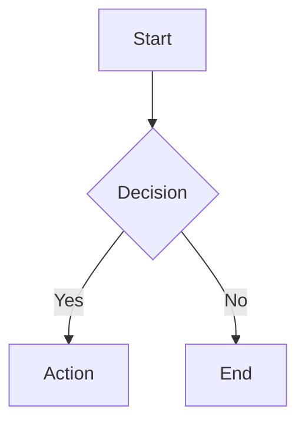

# Mermaid Zoom Preview

A VS Code extension that renders Mermaid diagrams in the markdown preview with interactive zoom, pan, fullscreen view, and export capabilities.


## Features

- **Mermaid Rendering** - Automatically renders Mermaid code blocks in markdown preview
- **Zoom & Pan** - Mouse wheel zoom and click-drag panning for large diagrams
- **Zoom Level Indicator** - See current zoom percentage at a glance
- **Fullscreen View** - Expand diagrams to full screen for detailed inspection
- **Export** - Save diagrams as PNG, JPG, or HTML files
- **State Persistence** - Zoom/pan position preserved when editing markdown
- **Theme Support** - Automatic light/dark/high-contrast theme detection
- **Accessible** - Full keyboard navigation and screen reader support

## Installation

### From VSIX (Recommended)

1. Download the latest `.vsix` file from [Releases](https://github.com/your-username/mermaid-zoom-preview/releases)
2. In VS Code, press `Ctrl+Shift+P` and run **Extensions: Install from VSIX...**
3. Select the downloaded `.vsix` file

### From Source

```bash
git clone https://github.com/your-username/mermaid-zoom-preview.git
cd mermaid-zoom-preview
npm install
npm run build
# Press F5 in VS Code to launch Extension Development Host
```

## Usage

1. Create a markdown file with a Mermaid code block:

````markdown

````

2. Open markdown preview (`Ctrl+Shift+V` or `Cmd+Shift+V`)

3. Interact with diagrams:
   - **Scroll** to zoom in/out
   - **Click + drag** to pan
   - **Double-click** to zoom in
   - Use the **control bar** for precise actions

### Control Bar

| Button | Action |
|--------|--------|
| `100%` | Current zoom level |
| `+` | Zoom in |
| `-` | Zoom out |
| `Fit` | Fit diagram to container width |
| `Reset` | Reset to default view |
| `Fullscreen` | Open fullscreen modal |
| `Export` | Download as PNG/JPG/HTML |

## Configuration

Access settings via **File > Preferences > Settings** and search for "mermaid-zoom".

| Setting | Default | Description |
|---------|---------|-------------|
| `enabled` | `true` | Enable zoom/pan functionality |
| `mouseWheelZoom` | `true` | Enable mouse wheel zoom |
| `doubleClickZoom` | `true` | Enable double-click to zoom |
| `showControls` | `"hover"` | Control visibility: `"always"`, `"hover"`, `"never"` |
| `showZoomLevel` | `true` | Show zoom percentage indicator |
| `showFullscreenButton` | `true` | Show fullscreen button |
| `showExportButton` | `true` | Show export dropdown |
| `minZoom` | `0.1` | Minimum zoom level (10%) |
| `maxZoom` | `20` | Maximum zoom level (2000%) |
| `zoomSensitivity` | `0.3` | Zoom speed (0.1 = slow, 1.0 = fast) |
| `exportScale` | `2` | Export resolution multiplier (1-4) |
| `lightTheme` | `"default"` | Mermaid theme for light mode |
| `darkTheme` | `"dark"` | Mermaid theme for dark mode |

### Theme Options

Available themes: `default`, `forest`, `dark`, `neutral`, `base`

## Supported Diagram Types

All Mermaid diagram types are supported:

- Flowcharts
- Sequence diagrams
- Class diagrams
- State diagrams
- Entity Relationship diagrams
- Gantt charts
- Pie charts
- Git graphs
- Journey diagrams
- And more...

See [Mermaid documentation](https://mermaid.js.org/) for syntax details.

## Development

### Prerequisites

- Node.js 18+
- VS Code 1.85+

### Commands

```bash
npm install          # Install dependencies
npm run build        # Build extension
npm run watch        # Watch mode for development
npm run package      # Create .vsix package
```

### Testing

1. Press `F5` to launch Extension Development Host
2. Open `test-workspace/sample.md`
3. Open markdown preview (`Ctrl+Shift+V`)

## Contributing

Contributions are welcome! Please feel free to submit issues and pull requests.

## License

MIT License - see [LICENSE](LICENSE) for details.

## Acknowledgments

- [Mermaid.js](https://mermaid.js.org/) - Diagram rendering
- [svg-pan-zoom](https://github.com/bumbu/svg-pan-zoom) - Pan/zoom functionality
