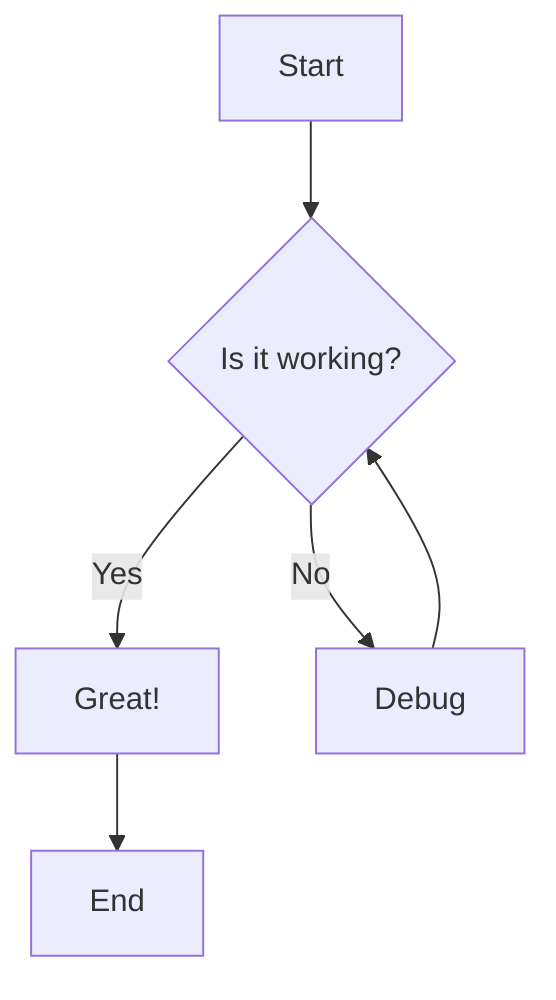
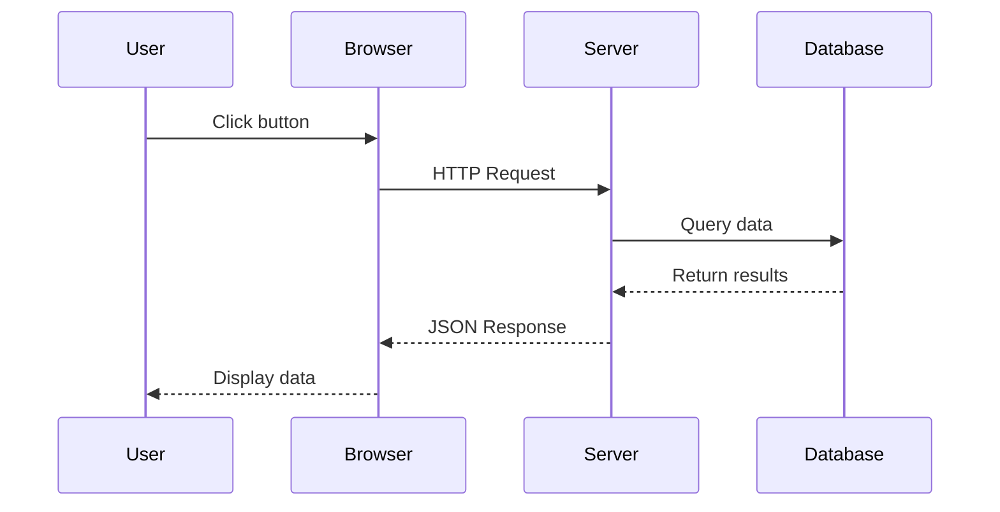
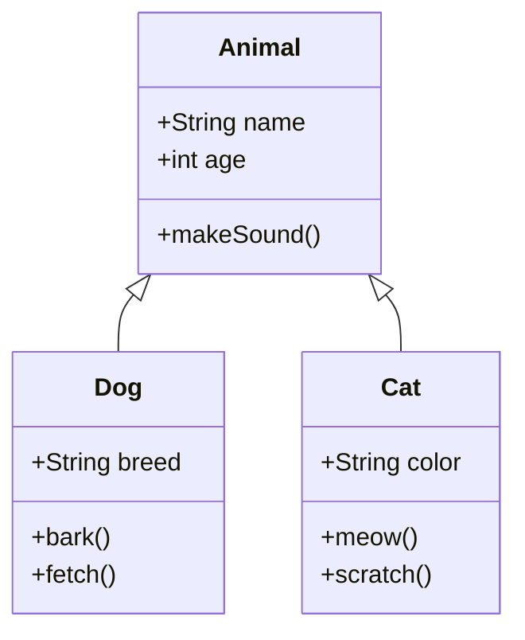
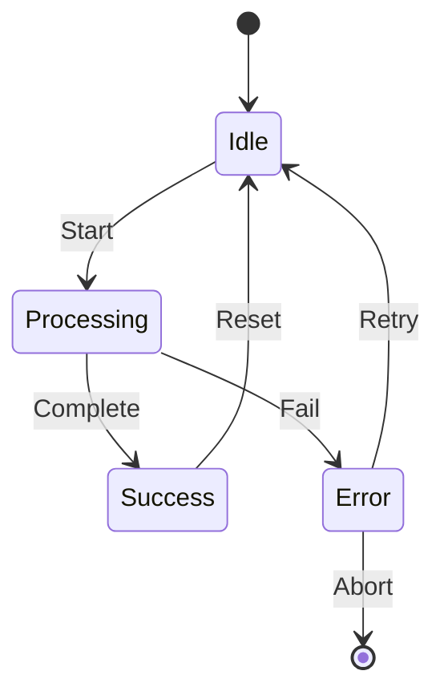
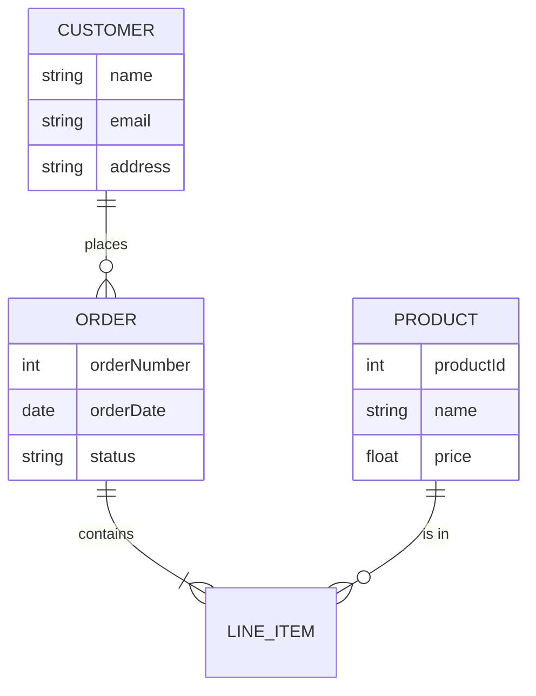
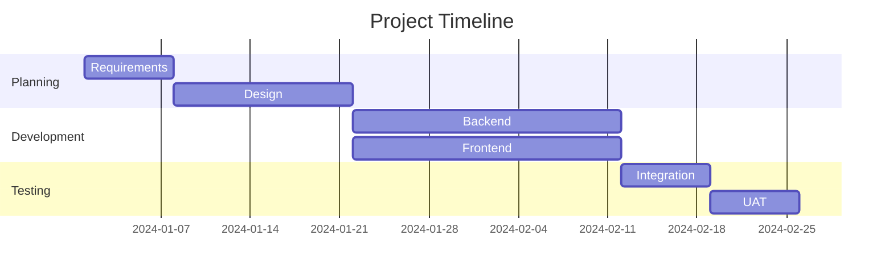
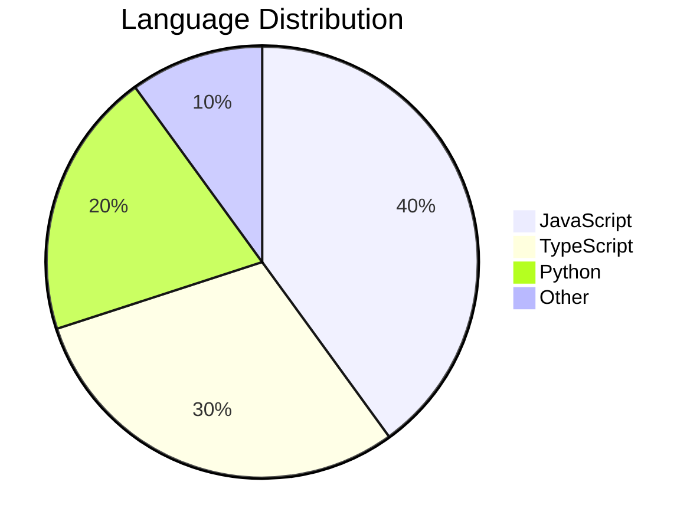
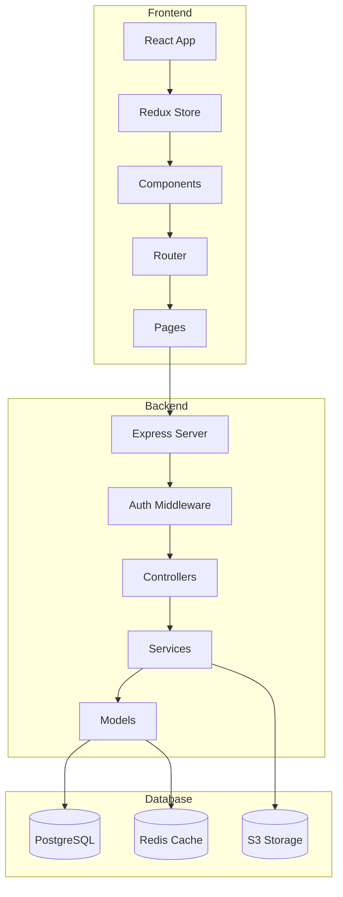

# Mermaid Zoom Preview - Test File

This file contains various Mermaid diagrams to test the zoom and pan functionality.

## Simple Flowchart

## Sequence Diagram

## Class Diagram

## State Diagram

## Entity Relationship Diagram

## Gantt Chart

## Pie Chart

## Complex Flowchart (for testing zoom)

---

## Testing Instructions

1. **Zoom In**: Use the mouse wheel to scroll up, or click the [+] button
2. **Zoom Out**: Use the mouse wheel to scroll down, or click the [-] button
3. **Pan**: Click and drag anywhere on the diagram
4. **Reset**: Click the reset button to fit the diagram to view
5. **State Persistence**: Edit this file and verify zoom state is preserved
